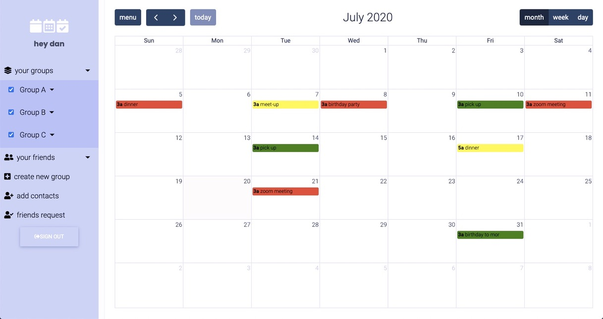
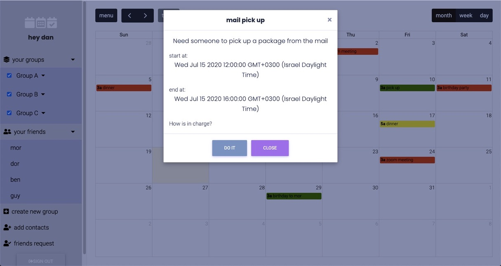

# Group Calendar

* create your groups and add your friends
* send and receive friends request
* share events with your friends and manage your events

## Setup

```sh
$ git clone https://github.com/gal-ch/group-organizer.git
$ cd group-organizer
```

Create a virtual environment to install dependencies in and activate it:

```sh
$ virtualenv venv
$ source venv/bin/activate
```

Then install the dependencies:

```sh
(venv)$ pip install -r requirements.txt
```

Once finished:

```sh
(venv)$ python manage.py runserver
```

go to `http://127.0.0.1:8000/calendar/`.

## Screenshots




